# 🎸 Fábrica de Violões – Padrão Prototype

Implementação do **Padrão de Projeto Prototype** em Java para uma fábrica de instrumentos musicais (violões), desenvolvida como atividade da disciplina de Padrões de Projeto.

---

## 📐 Estrutura do Projeto

```
Aula IX/
├── src/
│   ├── clonagem_superficial/      # Aplicação 1 – Clonagem Superficial
│   │   ├── Violao.java                  # Prototype abstrato (Cloneable)
│   │   ├── EspecificacoesTecnicas.java  # Objeto interno (referência compartilhada)
│   │   ├── ViolaoClassico.java
│   │   ├── ViolaoFolk.java
│   │   ├── ViolaoFlet.java
│   │   ├── ViolaoJumbo.java
│   │   ├── Violao7Cordas.java
│   │   ├── Violao12Cordas.java
│   │   ├── ViolaoZero.java
│   │   ├── ViolaoDuploZero.java
│   │   ├── ViolaoTriploZero.java
│   │   ├── FabricaDeVioloes.java        # Prototype Registry
│   │   └── MainSuperficial.java         # Cliente (main)
│   │
│   └── clonagem_profunda/         # Aplicação 2 – Clonagem Profunda
│       ├── Violao.java                  # Prototype abstrato (clone profundo)
│       ├── EspecificacoesTecnicas.java  # Objeto interno (construtor de cópia)
│       ├── ViolaoClassico.java
│       ├── ViolaoFolk.java
│       ├── ViolaoFlet.java
│       ├── ViolaoJumbo.java
│       ├── Violao7Cordas.java
│       ├── Violao12Cordas.java
│       ├── ViolaoZero.java
│       ├── ViolaoDuploZero.java
│       ├── ViolaoTriploZero.java
│       ├── FabricaDeVioloes.java        # Prototype Registry
│       └── MainProfunda.java            # Cliente (main)
│
└── README.md
```

---

## 🎯 Padrão Prototype

O **Prototype** é um padrão criacional que permite copiar objetos existentes sem que o código dependa de suas classes concretas. Em vez de instanciar novos objetos do zero, a fábrica mantém um **registro de protótipos** e entrega clones sob demanda.

### Participantes

| Papel | Classe(s) |
|---|---|
| **Prototype** (interface) | `Violao` (método `clone()`) |
| **ConcretePrototype** | `ViolaoClassico`, `ViolaoFolk`, `ViolaoFlet`, `ViolaoJumbo`, `Violao7Cordas`, `Violao12Cordas`, `ViolaoZero`, `ViolaoDuploZero`, `ViolaoTriploZero` |
| **Prototype Registry** | `FabricaDeVioloes` |
| **Client** | `MainSuperficial` / `MainProfunda` |

---

## ⚖️ Clonagem Superficial vs. Profunda

| Aspecto | Superficial | Profunda |
|---|---|---|
| Mecanismo | `super.clone()` | `super.clone()` + construtor de cópia |
| Campos primitivos | ✅ Copiados | ✅ Copiados |
| Objetos internos | ⚠️ **Mesma referência** | ✅ **Nova instância** |
| Risco de efeito colateral | ⚠️ Alto | ✅ Nenhum |
| Quando usar | Objetos sem estado mutável interno | Objetos com atributos de referência mutáveis |

> **Exemplo de impacto:** alterar `EspecificacoesTecnicas.preco` em um clone superficial afeta o protótipo original. Na clonagem profunda, cada clone possui seu próprio objeto, totalmente isolado.

---

## 🗂️ Tipos de Violão

| Tipo | Cordas | Material | Elétrico | Nível |
|---|---|---|---|---|
| Clássico | 6 | Nylon | Não | Iniciante |
| Folk | 6 | Aço | Sim | Intermediário |
| Flet | 6 | Nylon | Sim | Profissional |
| Jumbo | 6 | Aço | Sim | Intermediário |
| 7 Cordas | 7 | Nylon | Não | Intermediário |
| 12 Cordas | 12 | Aço | Não | Profissional |
| Zero (Parlor) | 6 | Nylon | Não | Iniciante |
| Duplo Zero (Parlor) | 6 | Aço | Não | Iniciante |
| Triplo Zero (Parlor) | 6 | Nylon | Não | Iniciante |

---

## ▶️ Como Executar

### Compilar ambas as aplicações

```bash
# Na raiz do projeto (Aula IX/)
javac -d out src/clonagem_superficial/*.java src/clonagem_profunda/*.java
```

### Executar – Clonagem Superficial

```bash
java -cp out clonagem_superficial.MainSuperficial
```

### Executar – Clonagem Profunda

```bash
java -cp out clonagem_profunda.MainProfunda
```

### Tipos de violão disponíveis (digitar no console)
```
classico | folk | flet | jumbo | 7cordas | 12cordas | zero | duplozero | triplozero
```

---

## 📊 UML – Padrão Prototype – Fábrica de Violões

> **🔵 Azul escuro** = `Violao` abstrato (Prototype) &nbsp;|&nbsp; **🔵 Azul claro** = Violões concretos (ConcretePrototype)
> **🟡 Amarelo** = `EspecificacoesTecnicas` &nbsp;|&nbsp; **🟢 Verde** = `FabricaDeVioloes` (Registry) &nbsp;|&nbsp; **🟠 Laranja** = `Main` (Client)

---

### 🔁 Clonagem Superficial

> `super.clone()` apenas — objetos internos **compartilham a mesma referência** ⚠️

```mermaid
---
title: "Clonagem Superficial – Fábrica de Violões"
config:
  theme: base
  themeVariables:
    primaryColor: "#dbeafe"
    primaryBorderColor: "#3b82f6"
    primaryTextColor: "#1e3a5f"
    lineColor: "#374151"
    fontFamily: "Arial, sans-serif"
---
classDiagram
    direction BT
    class Violao {
        <<abstract>>
        #nome : String
        #tipoCorda : String
        #numeroCordas : int
        #eletrico : boolean
        #indicadoIniciantes : boolean
        #generoMusical : String
        #descricao : String
        #especificacoes : EspecificacoesTecnicas
        +clone() Violao
        +exibirDetalhes() void
        +getters() void
        +setters() void
    }

    class EspecificacoesTecnicas {
        -peso : String
        -preco : double
        -nivel : String
        +getters() void
        +setters() void
    }

    class FabricaDeVioloes {
        -catalogo : Map~String, Violao~
        +getViolao(tipo : String) Violao
        +listarCatalogo() void
    }

    class MainSuperficial {
        +main(args : String[]) void
    }

    class ViolaoClassico {
        +ViolaoClassico()
    }
    class ViolaoFolk {
        +ViolaoFolk()
    }
    class ViolaoFlet {
        +ViolaoFlet()
    }
    class ViolaoJumbo {
        +ViolaoJumbo()
    }
    class Violao7Cordas {
        +Violao7Cordas()
    }
    class Violao12Cordas {
        +Violao12Cordas()
    }
    class ViolaoZero {
        +ViolaoZero()
    }
    class ViolaoDuploZero {
        +ViolaoDuploZero()
    }
    class ViolaoTriploZero {
        +ViolaoTriploZero()
    }

    Violao <|-- ViolaoClassico   : herda
    Violao <|-- ViolaoFolk       : herda
    Violao <|-- ViolaoFlet       : herda
    Violao <|-- ViolaoJumbo      : herda
    Violao <|-- Violao7Cordas    : herda
    Violao <|-- Violao12Cordas   : herda
    Violao <|-- ViolaoZero       : herda
    Violao <|-- ViolaoDuploZero  : herda
    Violao <|-- ViolaoTriploZero : herda
    Violao *-- EspecificacoesTecnicas  : referencia compartilhada
    FabricaDeVioloes o-- Violao        : registra prototipos
    MainSuperficial --> FabricaDeVioloes : usa

    classDef abstractViolao fill:#93c5fd,stroke:#1d4ed8,color:#1e3a5f,font-weight:bold
    classDef concreteViolao fill:#bfdbfe,stroke:#3b82f6,color:#1e3a5f
    classDef specs          fill:#fef08a,stroke:#ca8a04,color:#713f12,font-weight:bold
    classDef factory        fill:#bbf7d0,stroke:#16a34a,color:#14532d,font-weight:bold
    classDef mainClass      fill:#fed7aa,stroke:#ea580c,color:#7c2d12,font-weight:bold

    class Violao                abstractViolao
    class EspecificacoesTecnicas specs
    class FabricaDeVioloes      factory
    class MainSuperficial       mainClass
    class ViolaoClassico        concreteViolao
    class ViolaoFolk            concreteViolao
    class ViolaoFlet            concreteViolao
    class ViolaoJumbo           concreteViolao
    class Violao7Cordas         concreteViolao
    class Violao12Cordas        concreteViolao
    class ViolaoZero            concreteViolao
    class ViolaoDuploZero       concreteViolao
    class ViolaoTriploZero      concreteViolao
```



---

### 🔃 Clonagem Profunda

> `super.clone()` + construtor de cópia — cada clone tem seu **próprio objeto** ✅

```mermaid
---
title: "Clonagem Profunda – Fábrica de Violões"
config:
  theme: base
  themeVariables:
    primaryColor: "#dbeafe"
    primaryBorderColor: "#3b82f6"
    primaryTextColor: "#1e3a5f"
    lineColor: "#374151"
    fontFamily: "Arial, sans-serif"
---
classDiagram
    direction BT
    class Violao {
        <<abstract>>
        #nome : String
        #tipoCorda : String
        #numeroCordas : int
        #eletrico : boolean
        #indicadoIniciantes : boolean
        #generoMusical : String
        #descricao : String
        #especificacoes : EspecificacoesTecnicas
        +clone() Violao
        +exibirDetalhes() void
        +getters() void
        +setters() void
    }

    class EspecificacoesTecnicas {
        -peso : String
        -preco : double
        -nivel : String
        +EspecificacoesTecnicas(origem) construtor de copia
        +getters() void
        +setters() void
    }

    class FabricaDeVioloes {
        -catalogo : Map~String, Violao~
        +getViolao(tipo : String) Violao
        +listarCatalogo() void
    }

    class MainProfunda {
        +main(args : String[]) void
    }

    class ViolaoClassico {
        +ViolaoClassico()
    }
    class ViolaoFolk {
        +ViolaoFolk()
    }
    class ViolaoFlet {
        +ViolaoFlet()
    }
    class ViolaoJumbo {
        +ViolaoJumbo()
    }
    class Violao7Cordas {
        +Violao7Cordas()
    }
    class Violao12Cordas {
        +Violao12Cordas()
    }
    class ViolaoZero {
        +ViolaoZero()
    }
    class ViolaoDuploZero {
        +ViolaoDuploZero()
    }
    class ViolaoTriploZero {
        +ViolaoTriploZero()
    }

    Violao <|-- ViolaoClassico   : herda
    Violao <|-- ViolaoFolk       : herda
    Violao <|-- ViolaoFlet       : herda
    Violao <|-- ViolaoJumbo      : herda
    Violao <|-- Violao7Cordas    : herda
    Violao <|-- Violao12Cordas   : herda
    Violao <|-- ViolaoZero       : herda
    Violao <|-- ViolaoDuploZero  : herda
    Violao <|-- ViolaoTriploZero : herda
    Violao *-- EspecificacoesTecnicas : nova instancia independente
    FabricaDeVioloes o-- Violao       : registra prototipos
    MainProfunda --> FabricaDeVioloes : usa

    classDef abstractViolao fill:#93c5fd,stroke:#1d4ed8,color:#1e3a5f,font-weight:bold
    classDef concreteViolao fill:#bfdbfe,stroke:#3b82f6,color:#1e3a5f
    classDef specs          fill:#fef08a,stroke:#ca8a04,color:#713f12,font-weight:bold
    classDef factory        fill:#bbf7d0,stroke:#16a34a,color:#14532d,font-weight:bold
    classDef mainClass      fill:#fed7aa,stroke:#ea580c,color:#7c2d12,font-weight:bold

    class Violao                abstractViolao
    class EspecificacoesTecnicas specs
    class FabricaDeVioloes      factory
    class MainProfunda          mainClass
    class ViolaoClassico        concreteViolao
    class ViolaoFolk            concreteViolao
    class ViolaoFlet            concreteViolao
    class ViolaoJumbo           concreteViolao
    class Violao7Cordas         concreteViolao
    class Violao12Cordas        concreteViolao
    class ViolaoZero            concreteViolao
    class ViolaoDuploZero       concreteViolao
    class ViolaoTriploZero      concreteViolao
```


