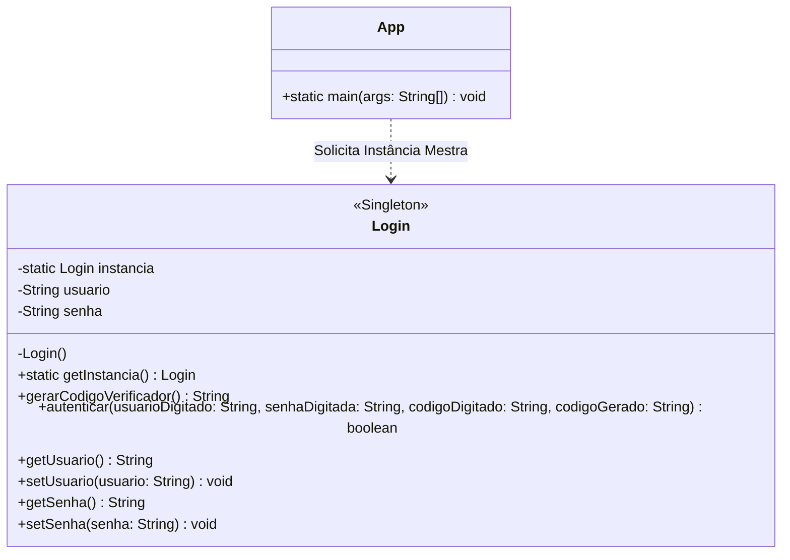
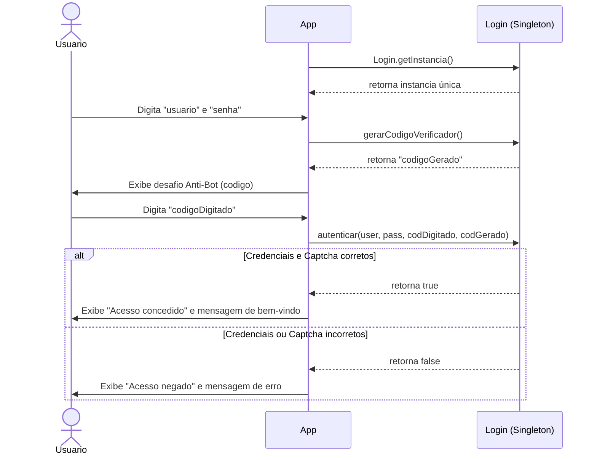

# Sistema de Login - Padrão Singleton

## Link do Código (Repositório)

**GitHub**: [https://github.com/SeuUsuario/SistemaLoginSingleton](https://github.com/SeuUsuario/SistemaLoginSingleton)  
*(Lembre-se de substituir o link acima pelo link real do seu repositório no Github após realizar o push do seu código)*

---

## Diagrama de Classes (Estrutural)

Abaixo está o diagrama de classes da aplicação, detalhando os atributos, métodos e demonstrando a estrutura do padrão de projeto em evidência (**Singleton**).

---

## Diagrama de Sequência (Comportamental)

Abaixo apresentamos o fluxo de interação e o processo de verificação antibot no momento do Login. É um excelente complemento para entender o papel de cada parte da aplicação em tempo de execução.

---

## Como Exportar este arquivo para PDF no VS Code

1. Instale a extensão chamada **Markdown PDF** no seu Visual Studio Code (caso ainda não tenha).
2. Clique com o botão direito em qualquer lugar deste arquivo aberto e selecione **"Markdown PDF: Export (pdf)"**.
3. O arquivo PDF será gerado automaticamente na mesma pasta.
