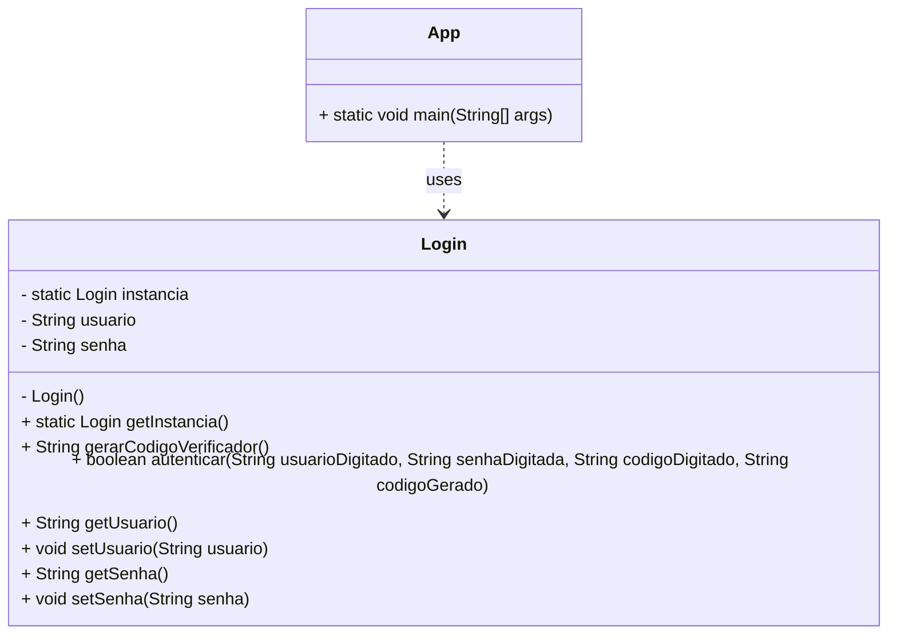

# Sistema de Login - Padrão Singleton

## Link do Código (Repositório)

**GitHub**: [https://github.com/SeuUsuario/SistemaLoginSingleton](https://github.com/SeuUsuario/SistemaLoginSingleton)  
*(Lembre-se de substituir o link acima pelo link real do seu repositório no Github após realizar o push do seu código)*

---

## Diagrama UML

Abaixo está o diagrama de classes da aplicação, demonstrando a estrutura do padrão de projeto Singleton.

## Como Exportar este arquivo para PDF no VS Code

1. Instale a extensão chamada **Markdown PDF** no seu Visual Studio Code (caso ainda não tenha).
2. Clique com o botão direito em qualquer lugar deste arquivo aberto e selecione **"Markdown PDF: Export (pdf)"**.
3. O arquivo PDF será gerado automaticamente na mesma pasta.
