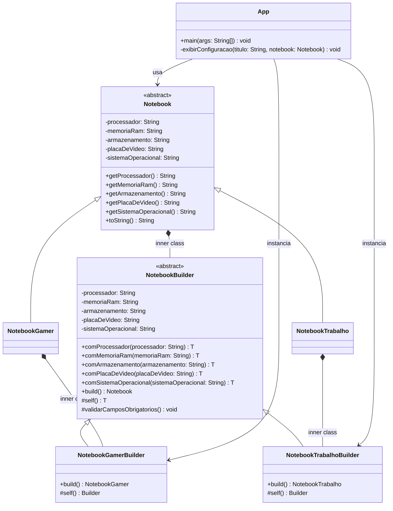

# Sistema de Configuracao de Notebooks

Projeto em Java para montagem de notebooks personalizados usando:

- Heranca
- Builder com Fluent Interface
- Inner Class
- Imutabilidade

## Objetivo

Permitir a criacao de notebooks com os componentes:

- Processador
- Memoria RAM
- Armazenamento
- Placa de Video
- Sistema Operacional

Todos os notebooks herdam da classe base `Notebook`, e a montagem e feita por builders fluentes.

## Estrutura

- `src/Notebook.java`: classe base abstrata com campos imutaveis e builder generico.
- `src/NotebookGamer.java`: tipo concreto de notebook gamer.
- `src/NotebookTrabalho.java`: tipo concreto de notebook para trabalho.
- `src/App.java`: classe principal com exemplos de montagem e exibicao.

## Como Executar

No terminal PowerShell, na raiz do projeto:

```powershell
if (Test-Path bin) { Remove-Item -Recurse -Force bin }
New-Item -ItemType Directory -Path bin | Out-Null
javac -d bin src\*.java
java -cp bin App
```

## Exemplo de Saida

```text
==============================================
			SISTEMA DE CONFIGURACAO DE NOTEBOOKS
==============================================

----------------------------------------------
Notebook Gamer
----------------------------------------------
Processador       : Intel Core i7-13700H
Memoria RAM       : 32GB DDR5
Armazenamento     : 1TB SSD NVMe
Placa de Video    : NVIDIA RTX 4060
Sistema Operacional: Windows 11 Pro

----------------------------------------------
Notebook de Trabalho
----------------------------------------------
Processador       : AMD Ryzen 7 7840U
Memoria RAM       : 16GB DDR5
Armazenamento     : 512GB SSD NVMe
Placa de Video    : Radeon 780M Integrada
Sistema Operacional: Ubuntu 24.04 LTS
```

## UML (Mermaid)

Use o bloco abaixo em um renderizador Mermaid:


