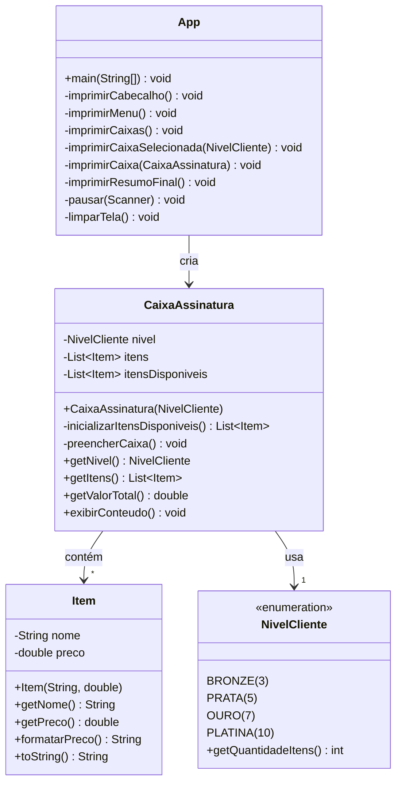

# Diagrama de Classes

```mermaid
classDiagram
    class App {
        +main(String[]) void
        -imprimirCabecalho() void
        -imprimirMenu() void
        -imprimirCaixas() void
        -imprimirCaixaSelecionada(NivelCliente) void
        -imprimirCaixa(CaixaAssinatura) void
        -imprimirResumoFinal() void
        -pausar(Scanner) void
        -limparTela() void
    }

    class Item {
        -String nome
        -double preco
        +Item(String, double)
        +getNome() String
        +getPreco() double
        +formatarPreco() String
        +toString() String
    }

    class NivelCliente {
        <<enumeration>>
        BRONZE(3)
        PRATA(5)
        OURO(7)
        PLATINA(10)
        +getQuantidadeItens() int
    }

    class CaixaAssinatura {
        -NivelCliente nivel
        -List~Item~ itens
        -List~Item~ itensDisponiveis
        +CaixaAssinatura(NivelCliente)
        -inicializarItensDisponiveis() List~Item~
        -preencherCaixa() void
        +getNivel() NivelCliente
        +getItens() List~Item~
        +getValorTotal() double
        +exibirConteudo() void
    }

    App --> CaixaAssinatura : cria
    CaixaAssinatura --> "*" Item : contém
    CaixaAssinatura --> "1" NivelCliente : usa
```
