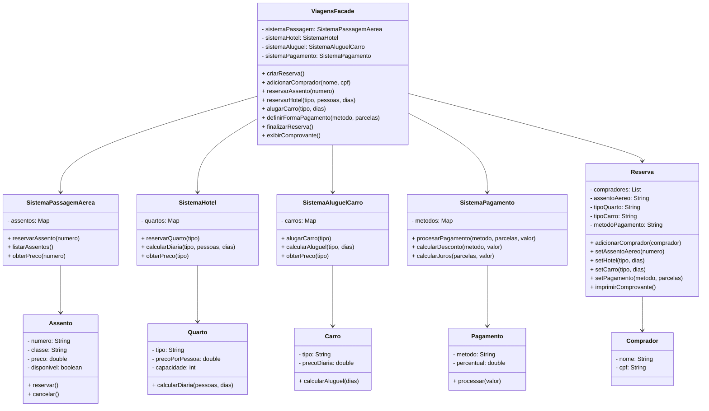

# Sistema de Venda de Pacotes de Viagens - Padrão Facade

## Últimas Atualizações ✓
- ✓ Listagem de assentos disponíveis **ANTES** de pedir o número
- ✓ Correção do tipo de carro "Executiva" (estava "Executivo")
- ✓ QR Code simulado no comprovante final

## UML de Classes (Mermaid)



## Subsistemas

### 1. **Passagem Aérea**

- **Classe**: `SistemaPassagemAerea`
- **Classes de Voo**: 1ª Classe (R$ 3.125), Executiva (R$ 1.250), Econômica (R$ 500)
- **Assentos**: 192 (32 fileiras × 6 assentos)
- **Localização**: Janela (A,F), Meio (B,E), Corredor (C,D)

### 2. **Hotel**

- **Classe**: `SistemaHotel`
- **Tipos**: Simples (R$ 200/pessoa), Executivo (R$ 500/pessoa), Suite (R$ 2.000/pessoa)
- **Cálculo**: Por pessoa e por dia

### 3. **Aluguel de Carro**

- **Classe**: `SistemaAluguelCarro`
- **Tipos**: Econômico (R$ 150/dia), Executivo (R$ 300/dia), Luxo (R$ 600/dia)

### 4. **Pagamento**

- **Classe**: `SistemaPagamento`
- **Formas**: PIX (-10%), Boleto (-5%), Débito (0%), Crédito (até 6x, +3,99% por parcela)

## Como Compilar e Executar

### Compilar

```bash
javac -d bin src/*.java
```

### Executar (com Menu)

```bash
java -cp bin Main
```

**O programa abrirá um menu com as opções:**

- Fazer uma nova reserva
- Ver disponibilidades  
- Executar testes automáticos
- Sair

## Exemplo de Uso

```
1. Sistema pede dados do(s) comprador(es)
2. Escolhe assento (ex: 5A)
3. Escolhe hotel (ex: Executivo, 3 dias)
4. Escolhe carro (ex: Econômico, 3 dias)
5. Escolhe pagamento (ex: PIX)
6. Sistema exibe comprovante com:
   - Dados de todos os compradores
   - Valores: passagem, hotel, carro
   - Subtotal
   - Desconto/Acréscimo
   - Total final
```

## Estrutura do Projeto

```
src/
├── Main.java
├── ViagensFacade.java (⭐ Padrão Facade)
├── SistemaPassagemAerea.java
├── SistemaHotel.java
├── SistemaAluguelCarro.java
├── SistemaPagamento.java
├── Assento.java
├── Quarto.java
├── Carro.java
├── Pagamento.java
├── Reserva.java
└── Comprador.java
```

## Requisitos Atendidos

✅ Sistema de passagem aérea com 3 classes e 192 assentos  
✅ Cálculo de preços corretos para cada classe  
✅ Sistema de hotel com 3 tipos de quarto  
✅ Sistema de aluguel de carro com 3 categorias  
✅ Sistema de pagamento com 4 formas (PIX, Boleto, Débito, Crédito)  
✅ Suporte a múltiplos compradores  
✅ Comprovante com todos os dados e valores  
✅ Padrão Facade bem aplicado  
