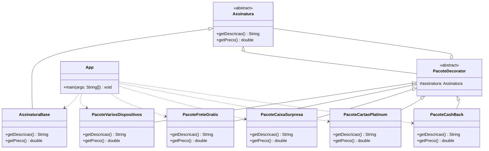

# Sistema de Assinatura de Streaming

Este projeto implementa uma estrutura de assinatura de serviço de streaming usando o padrão de projeto Decorator.

O usuário começa com a assinatura base e pode adicionar quantos pacotes opcionais quiser, desde que não repita o mesmo pacote.

## Objetivo

Modelar uma assinatura flexível, onde funcionalidades extras são adicionadas dinamicamente sem alterar a classe base da assinatura.

## Regras de Negócio

- Assinatura base: assistir vídeos em um único dispositivo por R$ 9,99.
- Pacote 1: assistir vídeos em vários dispositivos por R$ 19,99.
- Pacote 2: frete grátis em produtos por R$ 9,99.
- Pacote 3: caixa surpresa com produtos relacionados a filmes e séries por R$ 29,99.
- Pacote 4: cartão de crédito Platinum por R$ 49,99.
- Pacote 5: compra com Cash Back por R$ 19,99.
- O usuário pode escolher só a assinatura base ou adicionar qualquer combinação de pacotes.
- Pacotes repetidos são ignorados.

## Padrão Utilizado

O projeto usa o padrão Decorator para permitir a composição de comportamentos de forma incremental.

### Vantagens da abordagem

- Evita múltiplas classes para todas as combinações possíveis.
- Permite adicionar funcionalidades em tempo de execução.
- Mantém a responsabilidade de cada pacote isolada.

## Estrutura das Classes

- [App](src/App.java): ponto de entrada da aplicação, responsável pela interação com o usuário.
- [Assinatura](src/Assinatura.java): contrato abstrato da assinatura.
- [AssinaturaBase](src/AssinaturaBase.java): assinatura principal do serviço.
- [PacoteDecorator](src/PacoteDecorator.java): decorador base que encapsula uma assinatura.
- [PacoteVariosDispositivos](src/PacoteVariosDispositivos.java): pacote 1.
- [PacoteFreteGratis](src/PacoteFreteGratis.java): pacote 2.
- [PacoteCaixaSurpresa](src/PacoteCaixaSurpresa.java): pacote 3.
- [PacoteCartaoPlatinum](src/PacoteCartaoPlatinum.java): pacote 4.
- [PacoteCashBack](src/PacoteCashBack.java): pacote 5.

## UML



## Como Executar

### Compilar

```bash
javac -d bin src/*.java
```

### Executar

```bash
java -cp bin App
```

## Exemplo de Uso

Entrada:

```text
1 3 5 5
```

Saída esperada:

```text
Resumo da assinatura:
Assinatura base: assistir vídeos em um único dispositivo + Pacote 1: assistir vídeos em vários dispositivos + Pacote 3: caixa surpresa com produtos relacionados a filmes e séries + Pacote 5: compra com Cash Back
Total: R$79,96
```

## Observação

Este projeto foi mantido de forma simples para fins acadêmicos, com todas as classes organizadas em arquivos separados dentro da pasta [src](src).
