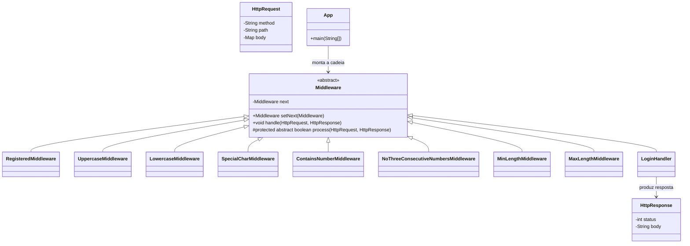

## Explicação da solução

Este exemplo simula um pipeline de requisições HTTP usando o padrão Chain of Responsibility. A ideia é simples: a requisição entra na cadeia, cada etapa decide se trata o pedido ou se repassa para a próxima, e a resposta é preenchida ao longo do caminho.

### Objetivo

Demonstrar como separar responsabilidades em camadas pequenas e independentes:

- logar a requisição;
- limitar tentativas por IP;
- autenticar o usuário;
- validar os dados enviados;
- executar a regra de negócio;
- devolver `404` quando nenhuma etapa anterior tratar a rota.

### Fluxo da chain

1. `LoggingMiddleware`: registra a requisição no console.
2. `RateLimitMiddleware`: controla quantas requisições um IP pode fazer.
3. `AuthMiddleware`: valida o token enviado no header `Authorization`.
4. `ValidationMiddleware`: verifica se os campos obrigatórios existem e têm tipo válido.
5. `CadastroHandler`: aplica a regra de negócio do cadastro.
6. `NotFoundFallback`: responde com `404` se a rota não for reconhecida.

### Responsabilidade de cada classe

- [src/App.java](src/App.java): ponto de entrada. Monta a cadeia e executa os exemplos.
- [src/Middleware.java](src/Middleware.java): classe base da chain. Guarda o próximo elemento e controla o repasse.
- [src/HttpRequest.java](src/HttpRequest.java): representa a requisição com método, caminho, headers e body.
- [src/HttpResponse.java](src/HttpResponse.java): representa a resposta final com status e mensagem.
- [src/LoggingMiddleware.java](src/LoggingMiddleware.java): faz apenas o log.
- [src/RateLimitMiddleware.java](src/RateLimitMiddleware.java): bloqueia excesso de requisições por IP.
- [src/AuthMiddleware.java](src/AuthMiddleware.java): valida a autenticação.
- [src/ValidationMiddleware.java](src/ValidationMiddleware.java): valida os dados da requisição.
- [src/CadastroHandler.java](src/CadastroHandler.java): executa a regra principal de cadastro.
- [src/NotFoundFallback.java](src/NotFoundFallback.java): garante uma resposta final quando nada anterior resolveu.
### Exercício: validação de login e senha (Chain of Responsibility)

Este repositório contém uma implementação simples, feita no estilo de um aluno do 5º período, que valida um par login/senha usando o padrão Chain of Responsibility.

Regras verificadas (em ordem):

1. Login cadastrado (lista em memória)
2. Pelo menos uma letra maiúscula
3. Pelo menos uma letra minúscula
4. Pelo menos um caractere especial (@, #, $, %, &, *)
5. Pelo menos um número
6. Não conter 3 números consecutivos em sequência (ex: 123)
7. Comprimento mínimo: 8
8. Comprimento máximo: 16

Arquivos principais em `src/`:

- `Middleware.java` - base abstrata da cadeia
- `HttpRequest.java`, `HttpResponse.java` - modelos simples
- `RegisteredMiddleware.java` - verifica se login existe
- `UppercaseMiddleware.java`, `LowercaseMiddleware.java`, `SpecialCharMiddleware.java`, `ContainsNumberMiddleware.java`, `NoThreeConsecutiveNumbersMiddleware.java`, `MinLengthMiddleware.java`, `MaxLengthMiddleware.java` - validações
- `LoginHandler.java` - verifica se a senha confere e responde sucesso
- `App.java` - monta a cadeia e roda cenários de teste

### Diagrama de classes (UML)



Como executar (Windows / PowerShell):

```powershell
javac -d bin src/*.java
java -cp bin App
```

O `App` já contém alguns usuários de exemplo e cenários de teste.
